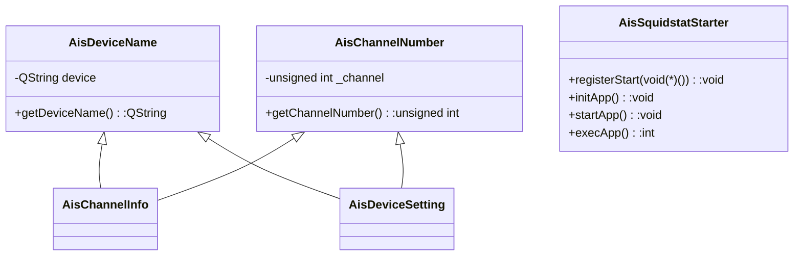
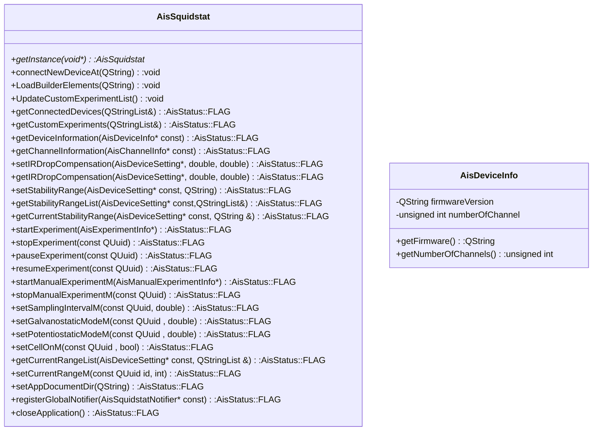
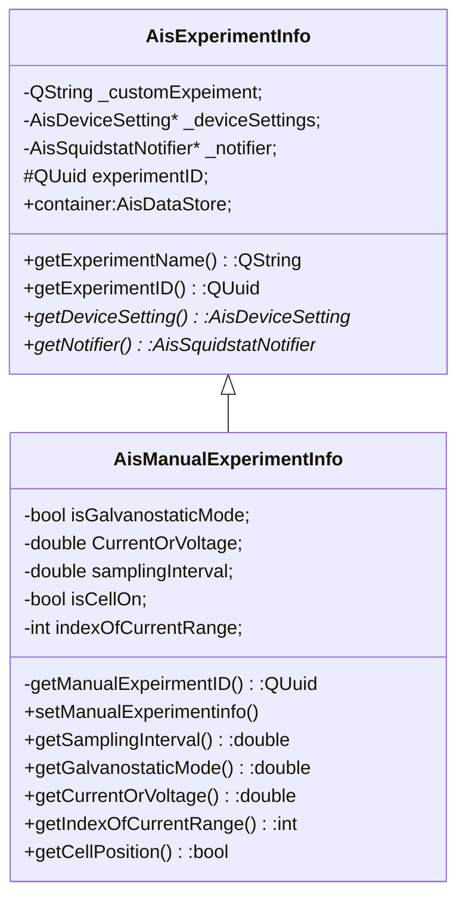

# Squidstat API User's Guide

- [Squidstat API User's Guide](#squidstat-api-users-guide)
    - [Notes on Distributions](#notes-on-distributions)
    - [Introduction](#introduction)
    - [Class diagram](#class-diagram)
    - [Class Definition: AisSquidstatStarter](#class-definition-aissquidstatstarter)
        - [AisSquidstatStarter Member Functions](#aissquidstatstarter-member-functions)
            - [registerStart](#registerstart)
            - [initApp](#initapp)
            - [startApp](#startapp)
            - [execApp](#execapp)
    - [Class Definition: AisSquidstat](#class-definition-aissquidstat)
        - [AisSquidstat Member Functions](#aissquidstat-member-functions)
            - [getInstance](#getinstance)
            - [connectNewDeviceAt](#connectnewdeviceat)
            - [LoadBuilderElements](#loadbuilderelements)
            - [UpdateCustomExperimentList](#updatecustomexperimentlist)
            - [getConnectedDevices](#getconnecteddevices)
            - [getCustomExperiments](#getcustomexperiments)
            - [getDeviceInformation](#getdeviceinformation)
            - [getChannelInformation](#getchannelinformation)
            - [setIRDropCompensation](#setirdropcompensation)
            - [getIRDropCompensation](#getirdropcompensation)
            - [setStabilityRange](#setstabilityrange)
            - [getStabilityRangeList](#getstabilityrangelist)
            - [getCurrentStabilityRange](#getcurrentstabilityrange)
            - [startExperiment](#startexperiment)
            - [stopExperiment](#stopexperiment)
            - [setAppDocumentDir](#setappdocumentdir)
            - [registerGlobalNotifier](#registerglobalnotifier)
            - [closeApplication](#closeapplication)
    - [Class Definition: AisDeviceSetting](#class-definition-aisdevicesetting)
    - [Class Definition: AisSquidstatNotifier](#class-definition-aissquidstatnotifier)
    - [Class Definition: AisExperimentInfo](#class-definition-aisexperimentinfo)
    - [Class Definition: AisManualExperimentInfo](#class-definition-aismanualexperimentinfo)
        - [AisManualExperimentInfo Member Functions](#aismanualexperimentinfo-member-functions)
            - [AisManualExperimentInfo](#aismanualexperimentinfo)
            - [setManualExperimentinfo](#setmanualexperimentinfo)
    - [Class Definition: AisDataStore](#class-definition-aisdatastore)
            - [getMinValue](#getminvalue)
            - [getMaxValue](#getmaxvalue)
            - [getAllDataPoints](#getalldatapoints)
            - [getAllStringDataPoints](#getallstringdatapoints)
            - [Misc Functions](#misc-functions)
    - [Class definition: AisDeviceInfo](#class-definition-aisdeviceinfo)
    - [Class Definition: AisChannelInfo](#class-definition-aischannelinfo)
    - [Example Project](#example-project)

## Notes on Distributions
API code was tested using QT 5.14.x, where we have verified it works best in. Included in the
distributions of API for Windows and Linux are the necessary files from QT 5.14.2 to run the example
projects. Mac users will need to manually install QT  5.14.x to run these same projects. The QT online
installer can be found [here](https://www.qt.io/download-open-source?hsCtaTracking=9f6a2170-a938-42df-a8e2-a9f0b1d6cdce%7C6cb0de4f-9bb5-4778-ab02-bfb62735f3e5).

## Introduction
The Squidstat API has two primary classes with which users can interact, and several helper classes that set and get information from the primary classes. All of the classes have the prefix “Ais,” for “Admiral Instruments” inside each class, not every public member is available to users, but only those with the macro ``SQUIDSTAT_DLL_SHARED_EXPORT`` in the signature.

The two primary classes are:

* [**AisSquidstatStarter**](#class-definition-aissquidstatstarter)
    * used to initiate the application loop that interacts with the instrument.

* [**AisSquidstat**](#class-definition-aissquidstat)
    * used to interact with the application loop, and deals with event handling and data transfer.

The helper classes as well as a brief description are as follows:
* [**AisDeviceSetting**](#class-definition-aisdevicesetting)
    *  a small class used to store the instrument serial name and channel number associated with an experiment.

* [**AisSquidstatNotifier**](#class-definition-aissquidstatnotifier)
    * An abstract class whose virtual functions are used as callback functions for when
      important events happen during an experiment. The user must create a derived class and
      implement the virtual functions in order to have their callbacks fired when data arrives or
      when the experiment pauses, resumes, or stops.
* [**AisExperimentInfo**](#class-definition-aisexperimentinfo)
    * Holds pointers to an [**AisDeviceSetting**](#class-definition-aisdevicesetting) object and an [**AisSquidstatNotifier**](#class-definition-aissquidstatnotifier) object in
      order to pass them to the member function [``startExperiment()``](#startexperiment).
      It also holds the container for the experimental data.
* [**AisManualExperimentInfo**](#class-definition-aismanualexperimentinfo)
   * Holds pointers to an [**AisDeviceSetting**](#class-definition-aisdevicesetting) object and an [**AisSquidstatNotifier**](#class-definition-aissquidstatnotifier) object in
      order to pass them to the member function [``startManualExperiment()``](#startexperiment).
      It also holds the container for the manual experimental data. It is derived form [**AisExperimentInfo**](#class-definition-aisexperimentinfo)
* [**AisDataStore**](#class-definition-aisdatastore)
    * Objects each hold one column’s worth of data (data from a single experimental variable, e.g.
      current, voltage, timestamp, etc.). Several [**AisDataStore**](#class-definition-aisdatastore) objects comprise a container for a
      given experiment, stored inside [**AisExperimentInfo**](#class-definition-aisexperimentinfo).
* [**AisDeviceInfo**](#class-definition-aisdeviceinfo)
    * An object that holds information about the firmware version and number of channels of a
      given device.
* [**AisChannelInfo**](#class-definition-aischannelinfo)
    * An object that in future API updates will contain information about the channel status.


In order to use the Squidstat API, the user will need to include the following header files:
* AisSquidstat.h
* DataLabels.h

## Class diagram






## Class Definition: AisSquidstatStarter
Defined in **AisSquidstatStarter.h**.

Public member functions:
```c++
AisSquidstatStarter();
~AisSquidstatStarter();
void registerStart(void(*)() func);
void initApp();
void startApp();
int execApp();
```

[**AisSquidstatStarter**](#class-definition-aissquidstatstarter) initializes all of the Squidstat API background processes and starts the
application loop that polls for events, such as data and notifications that arrive from the
hardware. The important member functions (for users **not** using the QtCoreApplication class to
build their application) are [``initApp()``](#initapp) and [``execApp()``](#execapp). For those users who use the QtCoreApplication
class, the [``startApp()``](#startapp) function will suffice.

The [**AisSquidstatStarter**](#class-definition-aissquidstatstarter) class also provides the ability to register a callback app with the
[``registerStart()``](#registerstart) function, which allows multi-threaded applications to coordinate asynchronously with
the return of the [``initApp()``](#initapp) function, which takes a few seconds to execute.

### AisSquidstatStarter Member Functions

#### registerStart

```c++
void registerStart(void(*)() func);
```

| Arguments  | Returns  |
|---|---|
| • Function Pointer with void return type and no arguments | • Nothing  |

The function [``initApp()``](#initapp) takes a one or two seconds to execute. The function [``registerStart()``](#registerstart) can be used to register a callback function that executes at the very end of [``initApp()``](#initapp). This can be useful in multi- threaded applications where the user does not want to wait for [``initApp()``](#initapp) to return before starting other processes.

#### initApp
```c++
void initApp();
```
| Arguments  | Returns  |
|---|---|
| • None  |  • Void |

This function initializes important background processes that interact with the hardware. It is
important to note that ``initApp()`` and [``execApp()``](#execapp) must be called on the same thread. This function must
be called before calling the static member function [``getInstance()``](#getinstance), or else
[``getInstance()``](#getinstance) will return a null pointer.

#### startApp
```c++
void startApp();
```
| Arguments  | Returns  |
|---|---|
| • None  |  • Void |

This function is for Qt application development only, and it should be called instead of [``initApp()``](#initapp)
and [``execApp()``](#execapp). In a Qt application, the user would first create a QtCoreApplication object and then
call its [``exec()``](https://doc.qt.io/qt-5/qcoreapplication.html#exec) member function. In a non-Qt project, [``initApp()``](#initapp) and [``execApp()``](#execapp) accomplish these two
tasks.

#### execApp
```c++
void execApp();
```
| Arguments  | Returns  |
|---|---|
| • None  |  • Void |

This function starts the control loop that polls for events related to Squidstat hardware activity.
It will handle all of the background processes that communicate with the instruments, and it also
fires the callbacks in [**AisSquidstatNotifier**](#class-definition-aissquidstatnotifier). This function will not return until
**AisSquidstat::closeApplication()** is called.

## Class Definition: AisSquidstat

Defined in **AisSquidstat.h**.

Public member functions:

```c++
~AisSquidstat();
static AisSquidstat* getInstance(void* mainWindow = nullptr);
void connectNewDeviceAt(QString comPortName = "");
void LoadBuilderElements(QString dllFilePath);
void UpdateCustomExperimentList();
AisStatus::FLAG getConnectedDevices(QStringList& connectedDevices);
AisStatus::FLAG getCustomExperiments(QStringList& customExperiments);
AisStatus::FLAG getDeviceInformation(AisDeviceInfo* const);
AisStatus::FLAG getChannelInformation(AisChannelInfo* const);
AisStatus::FLAG setIRDropCompensation(AisDeviceSetting* const, double UnCompenstatedResistance, double CompensatationLevel);
AisStatus::FLAG getIRDropCompensation(AisDeviceSetting* const, double &UnCompenstatedResistance, double &CompensatationLevel);
AisStatus::FLAG setStabilityRange(AisDeviceSetting* const, QString rangeName);
AisStatus::FLAG getStabilityRangeList(AisDeviceSetting* const, QStringList&);
AisStatus::FLAG getCurrentStabilityRange(AisDeviceSetting* const, QString tRangeRange);
AisStatus::FLAG startExperiment(AisExperimentInfo* experiment);
AisStatus::FLAG stopExperiment(const QUuid id);
AisStatus::FLAG setAppDocumentDir(QString documentDir);
AisStatus::FLAG registerGlobalNotifier(AisSquidstatNotifier* const);
void closeApplication();
```

The [**AisSquidstat**](#class-definition-aissquidstat) class is the primary way that users will control the connected devices. From
this class users can send commands to individual instruments, such as starting and stopping
experiments. There should only be one [**AisSquidstat**](#class-definition-aissquidstat) object running in a given application, and it
is acquired using the static getInstance() function, and not through a constructor.

### AisSquidstat Member Functions

#### getInstance
```c++
static AisSquidstat* getInstance(void* mainWindow = nullptr);
```

| Arguments  | Returns  |
|---|---|
| • Note that a nullptr is provided as the default argument; the user should never provide any arguments to this function. | • A pointer to the AisSquidstat object that is running all of the background processes. |


Note that this is a static member function. It provides a pointer to the object created by
[**AisSquidstatStarter**](#class-definition-aissquidstatstarter)::[``initApp()``](#initapp). This pointer gives access to the user to control connected
instruments.

#### connectNewDeviceAt
```c++
void connectNewDeviceAt(QString comPortName = "");
```
| Arguments  | Returns  |
|---|---|
| • A QString indicating the COM port at which to search for a device. If no COM port is specified, then the software will search all available COM ports for Squidstat devices.  | • Void |

This function initiates the search for Squidstat devices. The user can optionally specify a COM port
at which to search. If this argument is omitted, then the software will poll all available COM
ports. Any non-Squidstat devices at available COM ports will receive a “ping,” and the software will
wait until a response has timed out before continuing on to the next device on the list. Whenever a
Squidstat device is found, calibration data will automatically be downloaded if necessary, and the
[**AisSquidstatNotifier**](#class-definition-aissquidstatnotifier)::instrumentReadyToUse() callback will be fired.

#### LoadBuilderElements
```c++
void LoadBuilderElements(QString dllFilePath);
```
| Arguments  | Returns |
|---|---|
| • dllFilePath, a QString object that represents the directory path to where the Squidstat experiment “tile” library files are stored.  | • Void  |

Here the user must provide a directory path to where they have stored the library files
corresponding to the Squidstat User Interface’s “Experiment Builder tiles.” These library files are
installed during a normal installation of the Squidstat User Interface in “<installation
path>/Admiral Instruments/Squidstat/elements”. However, a set of library files for both debug and
release builds are also provided in the Squidstat API package. The path string should not terminate
with a “/”. The argument is a QString object, which is the Qt library version of std::string. The
directory path can be provided directly in the argument, like so:

```c++
auto app_handler = AisSquidstat::getInstance();
app_handler->LoadBuilderElements(
    “C:/SquidstatAPI files/SquidstatDLL/Debug/element”);
```

#### UpdateCustomExperimentList
```c++
void UpdateCustomExperimentList();
```
| Arguments  | Returns |
|---|---|
| • None  |  • Void |

This function is useful for users who want to add or edit custom experiment files on-the-fly. Each
custom experiment is stored as a JSON file, the text of which can be read and modified outside of
the Squidstat User Interface Experiment Builder. However, the JSON files are parsed when
[**AisSquidstatStarter**](#class-definition-aissquidstatstarter)::[``initApp()``](#initapp) is called. In order to refresh the list for new or modified
files, UpdateCustomExperimentList() must be called. Note that for existing JSON files that are
modified and not renamed, the API will not recognize any changes to the file unless the UUID field
inside the file is changed. Users can generate a new UUID using the class QUuid, which is included
in the Squidstat API. For more information on the QUuid class, see
https://doc.qt.io/qt-5/quuid.html.

#### getConnectedDevices
```c++
AisStatus::FLAG getConnectedDevices(QStringList& connectedDevices);
```
| Arguments  | Returns |
|---|---|
| • connectedDevices, a QStringList object that is passed by reference. It should be empty upon entering the function, and filled at return. | • AisStatus::NO_ERROR |


This function provides a list of serial numbers/device names of the Squidstat devices connected to
the software. Note that the API can only interact with and open connections that are closed when
[**AisSquidstatStarter**](#class-definition-aissquidstatstarter)::[``initApp()``](#initapp) is called, and so open instances of the Squidstat User Interface or
other programs running the Squidstat API will interfere with device connectivity. The Squidstat API
searches for newly connected devices only when the [**AisSquidstat**](#class-definition-aissquidstat)::connectNewDeviceAt() function
is called. For more information about the QStringList class, see
https://doc.qt.io/qt-5/qstringlist.html.


#### getCustomExperiments
```c++
AisStatus::FLAG getCustomExperiments(QStringList& customExperiments);
```

| Arguments  | Returns |
|---|---|
| • customExperiments, a QStringList object that is passed by reference. It should be empty upon entering the function, and filled at return.| • AisStatus::NO_ERROR |

This function provides a list of names of custom experiments that have been built and saved using
the Squidstat User Interface Experiment Builder tab. These experiments are saved in “<documents
path>/Admiral Instruments/Custom Experiments”.

#### getDeviceInformation
```c++
AisStatus::FLAG getDeviceInformation(AisDeviceInfo* const);
```

| Arguments  | Returns |
|---|---|
| • A pointer to an AisDeviceInfo object. The object should have the device name set to the device in question before calling getDeviceInformation. Upon return, the user can check the specified device’s firmware version and the number of channels. |  • AisStatus::NO_ERROR if the specified device is found. <br> • AisStatus::HANDLER_NOT_FOUND if the specified device is not connected.|

This function allow the user to check the firmware version and the number of channels a given device
has. The user creates an [**AisDeviceInfo**](#class-definition-aisdeviceinfo) object, specifying the device name/serial number in the
constructor. Then the user passes the pointer to that object to getDeviceInformation(). Upon return,
the user can call the [**AisDeviceInfo**](#class-definition-aisdeviceinfo) object’s getFirmware() and getNumberOfChannels() member
functions.

#### getChannelInformation
```c++
AisStatus::FLAG getChannelInformation(AisChannelInfo* const);
```

| Arguments  | Returns |
|---|---|
| • A pointer to an AisChannelInfo object. The object should have the device name and channel number before calling getChannelInformation.  |  • AisStatus::NO_ERROR if the specified device is found. <br> • AisStatus::HANDLER_NOT_FOUND if the specified device is not connected. <br> • AisStatus::INVALID_CHANNEL if the specified channel falls outside the valid range for the instrument. |

In this release of the Squidstat API, the [**AisChannelInfo**](#class-definition-aischannelinfo) object is not yet useful to the user. In
future versions users will be able to specify the desired instrument and channel and get information
on the channel’s status using this function, e.g. whether the instrument is idle, paused, or running
an experiment.

#### setIRDropCompensation
```c++
AisStatus::FLAG setIRDropCompensation(AisDeviceSetting* const,
double UnCompensatedResistance, double CompensationLevel);
```

| Arguments  | Returns |
|---|---|
| • A pointer to an AisDeviceSetting object, indicating the device name and channel number. <br> • UncompensatedResistance, a double, containing the uncompensated resistance (in Ohms) the user wishes to set. <br>  • CompensationLevel, a double, containing the compensation level (between 0 and 100, in percent) that the instrument should use. |  • AisStatus::NO_ERROR if the specified device is found. <br> • AisStatus::HANDLER_NOT_FOUND if the specified device is not connected. <br> • AisStatus::INVALID_CHANNEL if the specified channel falls outside the valid range for the instrument.|

This function allows the user to set the IR drop compensation settings, as one would in the
Squidstat User Interface menu. The user selects the desired instrument and channel by creating an
[**AisDeviceSetting**](#class-definition-aisdevicesetting) object and passing it to this function. The user also provides the two parameters
(doubles) specifying the uncompensated resistance and compensation level. For more information on IR
drop compensation and compensation settings, see the Squidstat User Interface manual.

#### getIRDropCompensation
```c++
AisStatus::FLAG getIRDropCompensation(AisDeviceSetting* const,
double &UncompensatedResistance, double &CompensationLevel);
```

| Arguments  | Returns |
|---|---|
| • A pointer to an AisDeviceSetting object, indicating the device name and channel number. <br> • UncompensatedResistance, a double, passed by reference. Upon return, it contains the uncompensated resistance (in Ohms) that the channel is using. <br> • CompensationLevel, a double, passed by reference. Upon return, it contains the compensation level (between 0 and 100 in percent) that the channel is using. |  • AisStatus::NO_ERROR if the specified device is found. <br> • AisStatus::HANDLER_NOT_FOUND if the specified device is not connected. <br> • AisStatus::INVALID_CHANNEL if the specified channel falls outside the valid range for the instrument.|

This function allows the user to read out the previously set IR drop compensation parameters. See
“setIRDropCompensation” and the Squidstat User Interface manual for more information.

#### setStabilityRange
```c++
AisStatus::FLAG setStabilityRange(AisDeviceSetting* const, QString rangeName);
```

| Arguments  | Returns  |
|---|---|
| • A pointer to an AisDeviceSetting object, indicating the device name and channel number. <br> • rangeName, a QString indicating the selected stability range |  • AisStatus::NO_ERROR if selection is successful. <br> • AisStatus::HANDLER_NOT_FOUND if the specified device is not connected. <br> • AisStatus::INVALID_CHANNEL if the specified channel falls outside the valid range for the instrument. <br> • AisStatus::INCOMPATIBLE_MODEL if the designated device does not have stability range settings. <br> • AisStatus::INVALID_STABILITY_RANGE if the indicated range does not exist for the specified model. |

This function allows the user to set the stability range settings for a channel on a device. The
name of the range must be specified by a QString passed to the function. The names of these strings
can be copied from the latest version of the Squidstat User Interface under More Options.
Alternatively, a list of range names valid for the given hardware model can be acquired using
getStabilityRangeList().

It is highly recommended to call setStabilityRange() before starting an
experiment. The hardware default stability range at power-up is usually not preferable. See the
default selection used in the Squidstat User Interface for a given model. For example, for the more
recent models of the Squidstat Plus, the preferred range is named “Capacitive loading (current <=
1mA)”.

For more information on stability ranges, see the Squidstat User Interface manual.

#### getStabilityRangeList
```c++
AisStatus::FLAG getStabilityRangeList(AisDeviceSetting* const, QStringList&);
```

| Arguments  | Returns  |
|---|---|
| • A pointer to an AisDeviceSetting object, indicating the device name and channel number. <br> • A QStringList object, passed by reference. This should be passed empty to the function, and upon return will be filled with the list of range names.  | • AisStatus::NO_ERROR if selection is successful. <br> • AisStatus::HANDLER_NOT_FOUND if the specified device is not connected. <br> • AisStatus::INCOMPATIBLE_MODEL if the designated device does not have stability range settings. |

This function allows the user to obtain a list of names of the given device’s possible stability
range settings. One of these names can then be passes to setStabilityRange(). For more information
about the QStringList class, see https://doc.qt.io/qt-5/qstringlist.html.

#### getCurrentStabilityRange
```c++
AisStatus::FLAG getCurrentStabilityRange(AisDeviceSetting* const, QString &currentRange);
```

| Arguments  | Returns |
|---|---|
| • A pointer to an AisDeviceSetting object, indicating the device name and channel number. <br>  • currentRange, a QString passed by reference. It should be empty when passed to the function, and upon return it contains the name of the selected stability range. |  • AisStatus::NO_ERROR if there are no errors. <br> • AisStatus::HANDLER_NOT_FOUND if the specified device is not connected. <br> • AisStatus::INCOMPATIBLE_MODEL if the designated device does not have stability range settings.|

This function enables the user to determine which stability range is currently selected for a given
device and channel.

#### startExperiment
```c++
AisStatus::FLAG startExperiment(AisExperimentInfo* experiment);
```

| Arguments  | Returns  |
|---|---|
| • A pointer to an AisExperimentInfo object, containing the device name, channel number, and experiment name. |  • AisStatus::NO_ERROR if there are no errors. <br> • AisStatus::HANDLER_NOT_FOUND if the specified device is not connected. <br> • AisStatus::CHANNEL_BUSY if the channel is busy running another experiment. <br> • AisStatus::EXPERIMENT_NOT_FOUND if the custom experiment is not found. <br> • AisStatus::NODE_UPLOAD_UNSUCCESSFUL if the API encounters an error while uploading the experiment parameters to the hardware. Often cycling power to the unit or disconnecting and reconnecting the device will fix this error.|

This function is called to start an experiment. The device, channel number, and experiment name are
stored inside of an [**AisExperimentInfo**](#class-definition-aisexperimentinfo) object passed into this function. To accomplish this, first
create an [**AisDeviceSetting**](#class-definition-aisdevicesetting) object, passing the instrument name and channel number into the
constructor. Then create an [**AisExperimentInfo**](#class-definition-aisexperimentinfo) object by passing the [**AisDeviceSetting**](#class-definition-aisdevicesetting) object as well
as the experiment name into the constructor. A pointer to an object that implements
[**AisSquidstatNotifier**](#class-definition-aissquidstatnotifier)’s virtual functions is also required. For example:

```c++
mDeviceSetting = new AisDeviceSetting(_InstrumentName, _channelNum);
mExperimentInfo = new AisExperimentInfo(mDeviceSetting, _ExperimentName, this);
```

This code snippet is inside a member function of a class that inherits from [**AisSquidstatNotifier**](#class-definition-aissquidstatnotifier)
and implements its virtual functions, hence the keyword “this” is used to pass the object pointer to
the [**AisExperimentInfo**](#class-definition-aisexperimentinfo) constructor.

#### stopExperiment
```c++
AisStatus::FLAG stopExperiment(const QUuid id);
```

| Arguments  | Returns |
|---|---|
| • Id, a QUuid object containing the experiment’s associated UUID  |  • AisStatus::NO_ERROR if there are no errors. <br> • AisStatus::HANDLER_NOT_FOUND if the experiment by the UUID cannot be found. <br> • AisStatus::EXPERIMENT_NOT_RUN_ON_CHANNEL if the experiment is not running in the first place.|

This function is used to prematurely end an experiment. The
[**AisSquidstatNotifier**](#class-definition-aissquidstatnotifier)::experimentStopped() is still fired when this function is called. The
experiment UUID can be accessed by calling getExperimentID() from the [**AisExperimentInfo**](#class-definition-aisexperimentinfo) that was
passed to the startExperiment() function.

#### setAppDocumentDir
```c++
AisStatus::FLAG setAppDocumentDir(QString documentDir);
```

| Arguments  | Returns  |
|---|---|
| • documentDir, a QString specifying the path of both the “Calibration files” and the “Custom Experiments” directories  |  • Always returns AisStatus::NO_ERROR |

This function is used to set the location of the Squidstat calibration files and custom experiment
files are stored. The default location is in “<Documents directory>/Admiral Instruments”, and this
is the location that the Squidstat User Interface application uses. However, this function allows
the user to specify an alternate location. Note that this function must be called before calling the
[**AisSquidstat**](#class-definition-aissquidstat)::connectNewDeviceAt() function because connectNewDeviceAt() reads and writes from the
calibration file directory.

#### registerGlobalNotifier
```c++
AisStatus::FLAG registerGlobalNotifier(AisSquidstatNotifier* const);
```

| Arguments  | Returns |
|---|---|
| • A pointer to an object derived from the AisSquidstatNotifier class  |  • Always returns AisStatus::NO_ERROR|

This function is used to register the callback functions that are called when instruments connect
and disconnect from the software. The argument is a pointer to an object that implements
[**AisSquidstatNotifier**](#class-definition-aissquidstatnotifier)’s virtual functions instrumentReadyToUse() and instrumentDisconnected().

#### closeApplication
```c++
void closeApplication();
```

| Arguments  | Returns  |
|---|---|
| • None  |  • Void |

This function stops the [**AisSquidstatStarter**](#class-definition-aissquidstatstarter)::execApp() loop and causes it to return. Device
connections are closed, and any experiments still running are stopped, and API background processes
are stopped. In Qt projects, this function will close the entire application since it calls
QCoreApplication::quit(), and therefore this function may not be appropriate to use for Qt Projects.

## Class Definition: AisDeviceSetting

Defined in **AisDeviceSetting.h**.

Public member functions:

```c++
AisDeviceSetting(QString deviceName, unsigned int channel);
~AisDeviceSetting();
```

Inherited member functions:
```c++
QString getDeviceName();
unsigned int getChannelNumber();
```

[**AisDeviceSetting**](#class-definition-aisdevicesetting) objects are used directly or indirectly to specify an instrument and channel number
when calling commands with the [**AisSquidstat**](#class-definition-aissquidstat) class. For example, setStabilityRange and
setIRDropCompensation() pass an [**AisDeviceSetting**](#class-definition-aisdevicesetting) object pointer as an argument, and
startExperiment() passes an [**AisExperimentInfo**](#class-definition-aisexperimentinfo) object pointer, which contains an [**AisDeviceSetting**](#class-definition-aisdevicesetting)
object pointer as one of its members.

Note that no default constructor exists for [**AisDeviceSetting**](#class-definition-aisdevicesetting),
so if you use this class as a member object inside a custom class, then you will need to either
include its constructor in an initialization list or use a pointer as the member instead.


## Class Definition: AisSquidstatNotifier

Defined in **AisSquidstatNotifier.h**.

Protected functions:

```c++
virtual void instrumentReadyToUse(QString);
virtual void instrumentDisconnected(QString);
virtual void readDCExperimentData(QUuid) = 0;
virtual void readACExperimentData(QUuid) = 0;
virtual void experimentStopped(QUuid) = 0;
virtual void experimentPaused(QUuid) = 0;
virtual void experimentResumed(QUuid) = 0;
```

The first two functions are callbacks used for “general” events: when instruments connect and
disconnect from the software. The callback instrumentReadyToUse() fires when an instrument
successfully connects to the software after [**AisSquidstat**](#class-definition-aissquidstat)::connectNewDeviceAt() is called. The
callback instrumentDisconnected() fires whenever an instrument disconnects from the software. Both
of these callbacks pass the name of the instrument as an argument. In order to use these callbacks,
the [**AisSquidstatNotifier**](#class-definition-aissquidstatnotifier) object that implements these virtual functions must be registered using
[**AisSquidstat**](#class-definition-aissquidstat)::registerGlobalNotifier().

The last five functions are callbacks used for events that happen during the course of an
experiment. The callback readDCExperimentData() fires when DC data is sampled (voltage and current
data sampled at a particular instance), and readACExperimentData fires when AC data is sampled
(complex impedance and frequency data sampled during an EIS sweep). The callbacks
experimentStopped(), experimentPaused(), and experimentResumed() fire when the experiment ends, when
the experiment is paused, and when the experiment resumes, respectively. Each of the callbacks
passes the QUuid associated with the experiment as an argument. This is useful in cases where the
user has registered the same callbacks with separate experiments and needs to identify which
experiment has fired the callback.

In order to use these experiment-related callbacks, [**AisSquidstatNotifier**](#class-definition-aissquidstatnotifier) object that implements
these virtual functions must be registered by creating an** AisExperimentInfo** object. This object will
take a pointer to the [**AisSquidstatNotifier**](#class-definition-aissquidstatnotifier) object in its constructor. Then a pointer to the
[**AisExperimentInfo**](#class-definition-aisexperimentinfo) object is passed to [**AisSquidstat**](#class-definition-aissquidstat)::StartExperiment().

Refer to the “Squidstat API Sample Project Documentation” manual for more explanation on how the
[**AisSquidstatNotifier**](#class-definition-aissquidstatnotifier) class and callbacks are used.

## Class Definition: AisExperimentInfo

Defined in **AisExperimentInfo.h**.

Public member functions
```c++
AisExperimentInfo(AisDeviceSetting* deviceSettings,QString customExperiment,
AisSquidstatNotifier* dataList);
QString getExperimentName();
QUuid getExperimentID();
AisDeviceSetting* getDeviceSetting();
AisSquidstatNotifier* getNotifier();
~AisExperimentInfo();
```

Public member objects:
```c++
AisDataMap container;
```

The [**AisExperimentInfo**](#class-definition-aisexperimentinfo) class serves two purposes: to pass the necessary info to
[**AisSquidstat**](#class-definition-aissquidstat)::startExperiment() and to give the user access to the experimental data, through the
**AisDataMap** “container” member. AisDataMap is a typedef for QMap<QString, [**AisDataStore**](#class-definition-aisdatastore)>. For more
information, see the documentation for [**AisSquidstat**](#class-definition-aissquidstat)::startExperiment() and for the [**AisDataStore**](#class-definition-aisdatastore)
class.

Each [**AisExperimentInfo**](#class-definition-aisexperimentinfo) object also stores a QUuid object (which holds an UUID) associated with a
running experiment. This UUID is generated when the object is created. This can be useful in
determining which experiment fired a callback when the same callbacks are registered to multiple
experiments. The QUuid object can be accessed with the member function getExperimentID().

Note that no default constructor exists for [**AisExperimentInfo**](#class-definition-aisexperimentinfo), so if you use this class as a member
object inside a custom class, then you will need to either include its constructor in an
initialization list or use a pointer as the member instead.


## Class Definition: AisManualExperimentInfo

Defined in **AisManualExperimentInfo.h**.

Public member functions
```c++

AisManualExperimentInfo(AisDeviceSetting* deviceSettings, AisSquidstatNotifier* notifier);
void setManualExperimentinfo(double samplingInterval = 1, bool isCellOn = false, int indexOfCurrentRange = 0,bool isGalvanostaticMode = false,double CurrentOrVoltage = 0 );
double getSamplingInterval() const;
bool getGalvanostaticMode() const;
double getCurrentOrVoltage() const;
int getIndexOfCurrentRange() const;
bool getCellPosition() const;
~AisManualExperimentInfo();
```
The [**AisManualExperimentInfo**](#class-definition-aismanualexperimentinfo) is use to start manual experiment. It is derived class of  [**AisExperimentInfo**](#class-definition-aisexperimentinfo).

### AisManualExperimentInfo Member Functions

#### AisManualExperimentInfo

```c++
AisManualExperimentInfo(AisDeviceSetting* deviceSettings, AisSquidstatNotifier* notifier);
```

| Arguments  | Returns  |
|---|---|
| ``deviceSettings``   assign instrument serial name and channel <br> ``notifier`` assign notifier for manual experiment   | • Nothing  |


This function is help to create the function experiment. It will take two argument. Pointer of
AisDeviceSetting is help to specify the instrument name and Channel number. Pointer of
[**AisSquidstatNotifier**](#class-definition-aissquidstatnotifier) is help to call back method for
manual experiment.


#### setManualExperimentinfo

```c++
void setManualExperimentinfo(double samplingInterval = 1, bool isCellOn = false, int indexOfCurrentRange = 0,bool isGalvanostaticMode = false,double CurrentOrVoltage = 0 );
```

| Arguments  | Returns  |
|---|---|
| ``samplingInterval`` set sampling interval <br> ``isCellOn`` set the cell position  <br>  isGalvanostaticMode`  | • Nothing  |

This funcation is help to create the funcation experiment. It will take two argument. Pointer of AisDeviceSetting is help to specify the instrument name and Channel number. Pointer of [**AisSquidstatNotifier**](#class-definition-aissquidstatnotifier) is help to call back method for manual experiment.


## Class Definition: AisDataStore

Defined in **AisDataStore.h**.

Public member functions:

```c++
AisDataStore();
qreal getMinValue();
qreal getMaxValue();
QList<qreal> getAllDataPoints();
QStringList getAllStringDataPoints();
bool isDataListEmpty();
bool isStringDataListEmpty();
qreal firstDataPoint();
qreal lastDataPoint();
QString firstStringData();
QString lastStringData();
int numberOfDataPoints();
void removeAllDataPoints();
```
The [**AisExperimentInfo**](#class-definition-aisexperimentinfo) member function “container” is an **AisDataMap**, which is a typedef for
QMap<QString, [**AisDataStore**](#class-definition-aisdatastore)>. Each [**AisDataStore**](#class-definition-aisdatastore) object inside an **AisDataMap** holds a given column of
data, stored as a key-value pair. The list of keys is given in DataLabels.h, which is organized into
three categories: “DC data keys,” “AC data keys,” and “Common keys.”

Each [**AisDataStore**](#class-definition-aisdatastore) object contains a list of data, either of text or of doubles. The first type of
data is accessed by the DC data keys. This is data sampled in the time domain, during a constant
potential or constant current interval, a current or potential sweep, a current or potential pulse
train, a constant power or constant resistance interval, or an open circuit interval. The second
type of data is accessed by the AC data keys. This is data sampled in the frequency domain, during
EIS sweeps. AC and DC data are expressed as qreal’s (a typedef for double). All DC data lists in a
given experiment will share the same length, as will all AC data lists.

The third data category of data, accessed by the “Common keys,” includes information about the
experiment phase: “Step name” and “Step number.” Each data point is expressed as a QString. Instead
of one data point generated per AC sample or DC sample, in “Common keys” category there is one
QString generated at the beginning of every experiment “substep.” It is not always intuitive to the
user how many substeps comprise an experiment; therefore, it is not straightforward to correlate the
correct step name and number with a given AC or DC data point. The recommended strategy is to look
up the latest step name and number in the [**AisDataStore**](#class-definition-aisdatastore) list whenever an AC or DC data point arrives.
For example:

```c++
void SquidstatAppHandler::readDCExperimentData(QUuid id) {
    qreal time = mExperimentInfo->container[DCDATA_ELAPSED_TIME_S].lastDataPoint();
    qreal WE = mExperimentInfo->container[DCDATA_WORKING_ELECTRODE].lastDataPoint();
    qreal current = mExperimentInfo->container[DCDATA_CURRENT].lastDataPoint();
    QString ExperimentSubstepName = mExperimentInfo->container[CURRENT_NODE_NAME].lastStringData();
    QString text = ExperimentSubstepName +": ";
    text += QString::number(time) + "(s), ";
    text += QString::number(WE) + "(V), ";
    text += QString::number(current) + "(mA)\n";
    cout << text.toStdString();
}
```

For more information on how to access experimental data from the [**AisExperimentInfo**](#class-definition-aisexperimentinfo) “container”
member object, refer to the “Squidstat API Sample Project Documentation.”

Here is a brief description of each of the public member functions:

* getMinValue() returns the most negative data point (only for [**AisDataStore**](#class-definition-aisdatastore) objects containing
  qreal (double) data)
#### getMinValue
```c++
void getMinValue();
```

| Arguments  | Returns  |
|---|---|
| • None  |  • qreal, the furthest left data point on the ordered real number line on the condition that the **AisDataStore** contains only qreal (double) data. |

#### getMaxValue
```c++
void getMaxValue()
```
| Arguments  | Returns  |
|---|---|
| • None  |  • qreal, the furthest right data point on the ordered real number line on the condition that the **AisDataStore** contains only qreal (double) data. |

#### getAllDataPoints
```c++
QList<qreal> getAllDataPoints();
```
| Arguments  | Returns  |
|---|---|
| • None  |  • QList<qreal>, all of the data points in a list, on the condition that **AisDataStore** contains only qreal (double) data.|

#### getAllStringDataPoints
```c++
QStringList getAllStringDataPoints();
```
| Arguments  | Returns  |
|---|---|
| • None  |  • QStringList of text data on the condition that **AisDataStore** contains QString data. For more information about the QStringList class, see https://doc.qt.io/qt- 5/qstringlist.html.|

#### Misc Functions
These functions are provided for convenience and do as they say on the tin.

* bool isDataListEmpty() returns true if there is no qreal (double) data in the list.
* bool isStringDataListEmpty() returns true if there is no text data in the list.
* firstDataPoint() returns the first data point in the qreal (double) list.
* qreal lastDataPoint() returns the last data point in the qreal (double) list.
* QString firstStringData() returns the first data point in the QString list.
* QString lastStringData() returns the last data point in the QString list.
* int numberOfDataPoints() returns the length of the data list.
* void removeAllDataPoints() clears all data stored in the list.

## Class definition: AisDeviceInfo

Defined in **AisDeviceInfo.h**.

Public member functions:

```c++
AisDeviceInfo(const QString deviceName);
~AisDeviceInfo();
QString getFirmware();
unsigned int getNumberOfChannels();
```

Inherited member functions:

```c++
QString getDeviceName();
```

The [**AisDeviceInfo**](#class-definition-aisdeviceinfo) class is used to get the firmware information and number of channels for a
specified device. Create an [**AisDeviceInfo**](#class-definition-aisdeviceinfo) object by passing the device name to the constructor. Then
pass a pointer to the [**AisDeviceInfo**](#class-definition-aisdeviceinfo) object to [**AisSquidstat**](#class-definition-aissquidstat)’s member function getDeviceInformation().
When the function returns you can use getFirmware() to read the firmware version (stored as a
QString) and getNumberOfChannels() to determine the number of channels the device has.

Note that no default constructor exists for [**AisDeviceInfo**](#class-definition-aisdeviceinfo), so if you use this class as a member
object inside a custom class, then you will need to either include its constructor in an
initialization list or use a pointer as the member instead.

## Class Definition: AisChannelInfo

Defined in **AisChannelInfo.h**.

Public member functions:
```c++
AisChannelInfo(const QString deviceName,unsigned int channel = 0);
~AisChannelInfo();
```

Inherited members

```c++
QString getDeviceName();
unsigned int getChannelNumber();
```

The [**AisChannelInfo**](#class-definition-aischannelinfo) class will be used in future Squidsat API releases to get the status of a
specified channel on a device. As of this release, however, [**AisChannelInfo**](#class-definition-aischannelinfo) does not contain any
useful information. This class will be used in the following way: create an [**AisChannelInfo**](#class-definition-aischannelinfo) object by
passing the device name and channel number to the constructor. Then pass a pointer to this object to
[**AisSquidstat**](#class-definition-aissquidstat)’s member function getChannelInformation(). When the function returns it will contain
useful information about the channel’s status, accessible through getter functions that have yet to
be implemented.


## Example Project