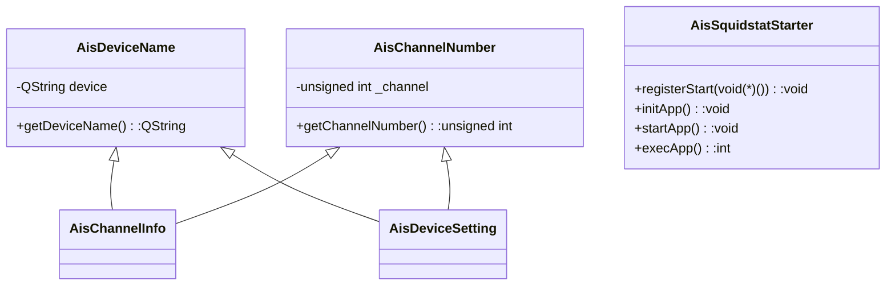
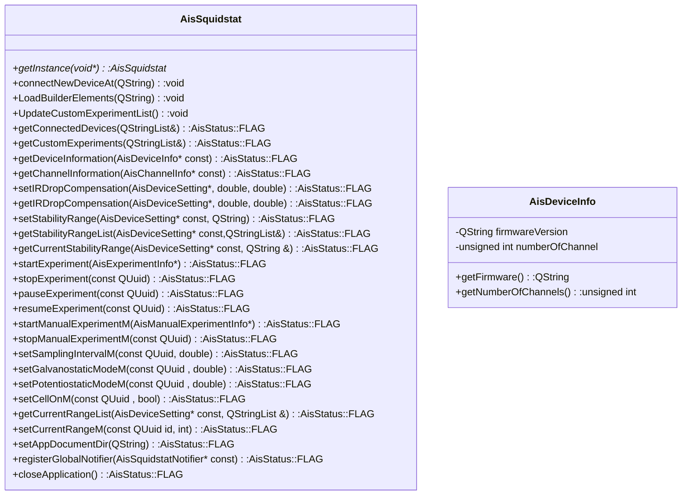
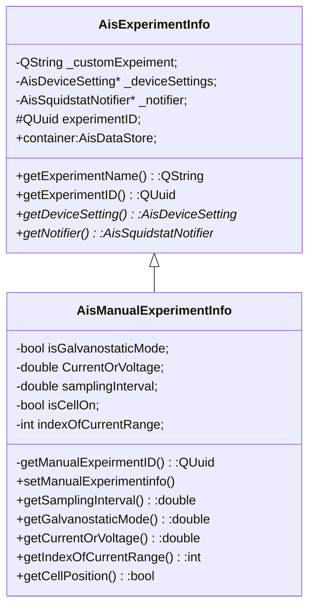

```mermaid
classDiagram
      AisDeviceName <|-- AisChannelInfo
      AisChannelNumber <|-- AisChannelInfo
      AisDeviceName <|-- AisDeviceSetting
      AisChannelNumber <|-- AisDeviceSetting
      class AisDeviceName{
          +getDeviceName():QString
          -QString device
      }
      class AisChannelNumber{
          -unsigned int _channel
          +getChannelNumber():unsigned int
      }
      class AisSquidstatStarter{
        +registerStart(void(*)()):void
        +initApp():void
        +startApp():void
        +execApp():int
      }
```

```mermaid
classDiagram
      class AisSquidstat{
        +getInstance(void*):AisSquidstat*
        +connectNewDeviceAt(QString):void
        +LoadBuilderElements(QString):void
        +UpdateCustomExperimentList():void
        +getConnectedDevices(QStringList& ):AisStatus::FLAG
        +getCustomExperiments(QStringList& ):AisStatus::FLAG
        +getDeviceInformation(AisDeviceInfo* const):AisStatus::FLAG
        +getChannelInformation(AisChannelInfo* const):AisStatus::FLAG
        +setIRDropCompensation(AisDeviceSetting*, double, double):AisStatus::FLAG
        +getIRDropCompensation(AisDeviceSetting*, double, double):AisStatus::FLAG
        +setStabilityRange(AisDeviceSetting* const, QString ):AisStatus::FLAG
        +getStabilityRangeList(AisDeviceSetting* const,QStringList&):AisStatus::FLAG
        +getCurrentStabilityRange(AisDeviceSetting* const, QString &):AisStatus::FLAG
        +startExperiment(AisExperimentInfo* ):AisStatus::FLAG
        +stopExperiment(const QUuid ):AisStatus::FLAG
        +pauseExperiment(const QUuid ):AisStatus::FLAG
        +resumeExperiment(const QUuid ):AisStatus::FLAG
        +startManualExperimentM(AisManualExperimentInfo* ):AisStatus::FLAG
        +stopManualExperimentM(const QUuid ):AisStatus::FLAG
        +setSamplingIntervalM(const QUuid, double ):AisStatus::FLAG
        +setGalvanostaticModeM(const QUuid , double ):AisStatus::FLAG
        +setPotentiostaticModeM(const QUuid , double ):AisStatus::FLAG
        +setCellOnM(const QUuid , bool ):AisStatus::FLAG
        +getCurrentRangeList(AisDeviceSetting* const, QStringList &):AisStatus::FLAG
        +setCurrentRangeM(const QUuid id, int ):AisStatus::FLAG
        +setAppDocumentDir(QString ):AisStatus::FLAG
        +registerGlobalNotifier(AisSquidstatNotifier* const):AisStatus::FLAG
        +closeApplication():AisStatus::FLAG
	   }
      class AisDeviceInfo{
          -QString firmwareVersion
	        -unsigned int numberOfChannel
          +getFirmware():QString
          +getNumberOfChannels():unsigned int
      }
```

```mermaid
classDiagram
      class AisExperimentInfo{
          -QString _customExpeiment;
	        -AisDeviceSetting* _deviceSettings;
	        -AisSquidstatNotifier* _notifier;
          #QUuid experimentID;
          +container:AisDataStore;
          +getExperimentName():QString
          +getExperimentID():QUuid
          +getDeviceSetting():AisDeviceSetting*
          +getNotifier():AisSquidstatNotifier*
      }
      AisExperimentInfo <|-- AisManualExperimentInfo
      class AisManualExperimentInfo{
         -getManualExpeirmentID():QUuid
         -bool isGalvanostaticMode;
         -double CurrentOrVoltage;
         -double samplingInterval;
         -bool isCellOn;
         -int indexOfCurrentRange;
         +setManualExperimentinfo()
         +getSamplingInterval():double
         +getGalvanostaticMode():double
         +getCurrentOrVoltage():double
         +getIndexOfCurrentRange():int
         +getCellPosition():bool
      }
```
